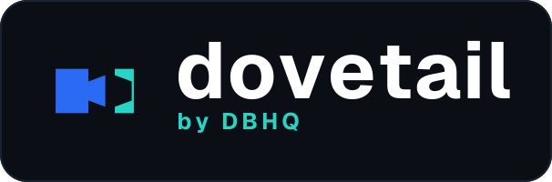

<div align="center">



# dovetail

**Does your repository still agree with itself?**

[](LICENSE)
[](https://code.claude.com/docs/en/plugins)
[]()

A free, open-source tool by [DBHQ](https://dbhq.uk)

</div>

---

A dovetail is the joint where two pieces interlock so precisely they cannot pull apart - and *"does that dovetail?"* is already the English idiom for *"do those two things agree?"*

dovetail builds an inventory and a typed reference graph of a repository, then reports where it has stopped agreeing with itself - and walks you through fixing it, one finding at a time.

Findings come from two layers, and you always know which you are looking at.

**Exact**, computed in Python in seconds with no model and no network: links that resolve to nothing, heading anchors that no longer exist, files nothing points at, duplicated and near-duplicated content, translations that have fallen behind, flags a doc claims that a script does not declare, documented calls the real signature would reject, code blocks that do not parse, manifests that disagree about the version, dead code, conventions the repo states but does not follow, TODOs that have been there for a year, and pairs of files that changed together for months and have just stopped.

**Judged**, from reviewers that only ever see what Python could not settle: contradictions between documents, documentation that describes behaviour the code no longer has, diagrams that no longer match the implementation, and duplicated logic where one copy was fixed and the other was not.

## What makes it different

**It is deterministic, and only deterministic.** No model calls, no API key, no network, no third-party packages. Every finding follows from the structure of the repository, so there is nothing to triage and nothing to second-guess.

**Which means you can fail a build on it.** A checker that produces false positives gets switched off within a week - the triage costs more than the drift. These findings are certain enough to gate a pull request, and the scan takes seconds, so it costs you nothing to run on every one.

**It never edits without asking.** The scan itself has no write path at all. Fixes happen only in the triage loop, only one at a time, and only on your say-so - and dovetail checks `git status` between edits, so if anything changes that it did not apply, the run stops.

**It does not guess which side is right.** *What disagrees* is decidable. *Which side is correct* usually is not: a broken link might mean the link is wrong or the target was deleted by mistake, and nothing in the file tree tells them apart. So a contradiction ends in a question rather than an edit.

**`--since` makes it adoptable.** A repository with existing drift cannot turn on a whole-repo check without every unrelated pull request going red, so nobody turns it on at all. `--since` scopes findings to the files a change actually touches, so you are only held to what you changed.

## Install

### As a Claude Code plugin (recommended)

```
/plugin marketplace add dbhq-uk/marketplace
/plugin install dovetail@dbhq
```

### Local install (Claude Code or Codex)

```bash
git clone https://github.com/dbhq-uk/dovetail-skill.git
cd dovetail-skill
./install.sh          # Claude Code: symlinks into ~/.claude/skills (edits are live)
./install-codex.sh    # Codex: installs into ~/.codex/skills
```

[`install.sh`](install.sh) and [`install-codex.sh`](install-codex.sh) are the same install two ways: Claude Code substitutes `${CLAUDE_SKILL_DIR}` so the whole skill directory is symlinked untouched, while Codex does not, so its `SKILL.md` is rewritten at install time.

**Nothing to install beyond that.** Python 3.11+ and `git`; no virtualenv, no packages, no credentials.

## Usage

Ask in any session: *"run dovetail on this repo"*. It scans, shows you what is certain first, and starts working through it while the judgement reviewers are still running.

Say *"run dovetail cheap"* to drop every reviewer a tier, or *"thorough"* to put them all on the strongest model. *"quick"* skips the reviewers entirely and gives you the exact findings only, for free.

Each finding offers `fix`, `edit`, `skip`, `intentional <why>`, `explain`, `all <category>` to batch a class, or `quit`. Dismissals go to `.dovetail/decisions.jsonl`, which is committed - so a judgement made once applies to your colleagues and to CI.

Or drive the scan directly:

Or drive it directly:

```bash
python3 ${CLAUDE_SKILL_DIR}/scripts/scan.py /path/to/repo --format json
```

| Flag | Meaning |
|---|---|
| `--format json\|github` | JSON to stdout, or GitHub workflow annotations |
| `--since <ref>` | Only report findings touching files changed since `<ref>` |
| `--fail-on none\|low\|medium\|high` | Exit non-zero when a finding at or above this severity exists |

## In CI

Two templates in [`skills/dovetail/ci/`](skills/dovetail/ci/), because the two jobs want opposite things.

[`dovetail-pr.yml`](skills/dovetail/ci/dovetail-pr.yml) runs on every pull request. Deterministic only - no model, no API key, no network - so it is fast, free, reproducible and safe to fail a build on. `--since` scopes findings to the diff, so a repository with existing debt can adopt it without every unrelated PR going red.

[`dovetail-scheduled.yml`](skills/dovetail/ci/dovetail-scheduled.yml) runs weekly and adds the judgement layer. It upserts a single tracking issue, found by label and rewritten in place, and **never fails the build** - a probabilistic merge gate is one people learn to override, which costs more than it catches.

`--since` resolves its base ref from history, so the workflow checks out with `fetch-depth: 0`. On a shallow clone the scan exits `2` and says so rather than passing silently - a check that reports success because it could not run is worse than no check at all.

## Suppressing a finding

Some findings are intentional: a vendored duplicate, an entry point nothing links to by design. Record the decision in `.dovetail/decisions.jsonl` in your repository:

```jsonl
{"id":"sha256:...","verdict":"intentional","reason":"why","at":"2026-07-28","summary":"human-readable echo"}
```

You append this yourself - the tool does not write to your repository. Because the file is committed, a judgement made once applies to everyone and to CI. Because the key is a fingerprint of the finding rather than a line number, it survives the file moving, but not the finding materially changing: if what you approved has become something else, it surfaces again.

Keep the `summary` field populated. It is redundant to the machine and load-bearing for you - without it the ledger is an unreadable list of hashes and nobody can audit their own past decisions.

## Configuration

`.dovetail/config.toml`, committed, all optional: ignore globs, the default model profile, per-check toggles and per-reviewer model overrides. See [`references/config.md`](skills/dovetail/references/config.md).

Repo-specific rules go in `.dovetail/checks/*.py` as modules exposing `check(inventory, graph)`. That is where "these three tables must stay in sync" belongs - written there it is exact and free, rather than something a model might notice. This repository ships one as a worked example: it asserts the reviewer table in `SKILL.md` matches the roster declared in `reviewer.py`.

## Tests

```bash
python3 -m pytest skills/dovetail/tests/ -v      # 359 tests, no model calls, no network
```

## Development

Want to hack on the skill or run it from source with live edits? See [`docs/dev-setup.md`](docs/dev-setup.md).

See [`docs/design-notes.md`](docs/design-notes.md) for why the tool is shaped this way, [`CONTRIBUTING.md`](CONTRIBUTING.md) to work on it, and [`AGENTS.md`](AGENTS.md) if you are an AI agent doing so - it states the three constraints that must not be broken.

The skill itself is [`skills/dovetail/SKILL.md`](skills/dovetail/SKILL.md).

## License

[MIT](LICENSE) © 2026 DBHQ Consulting Ltd
